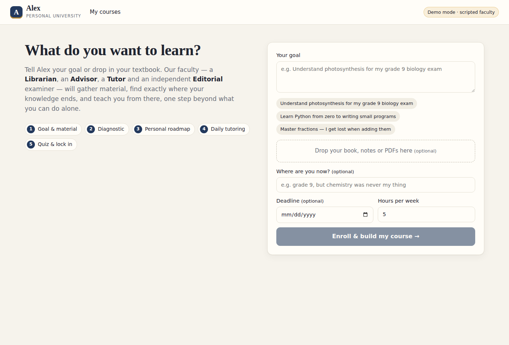
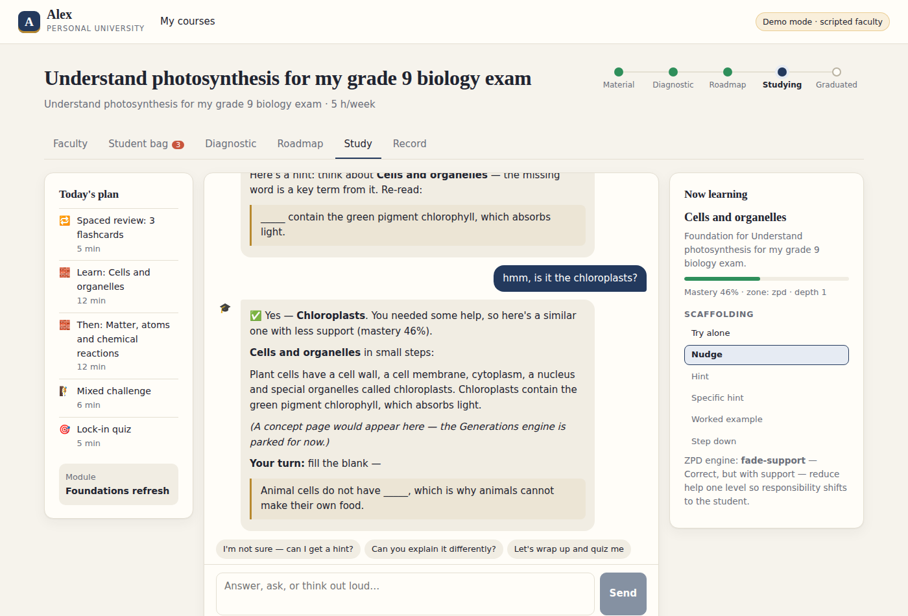
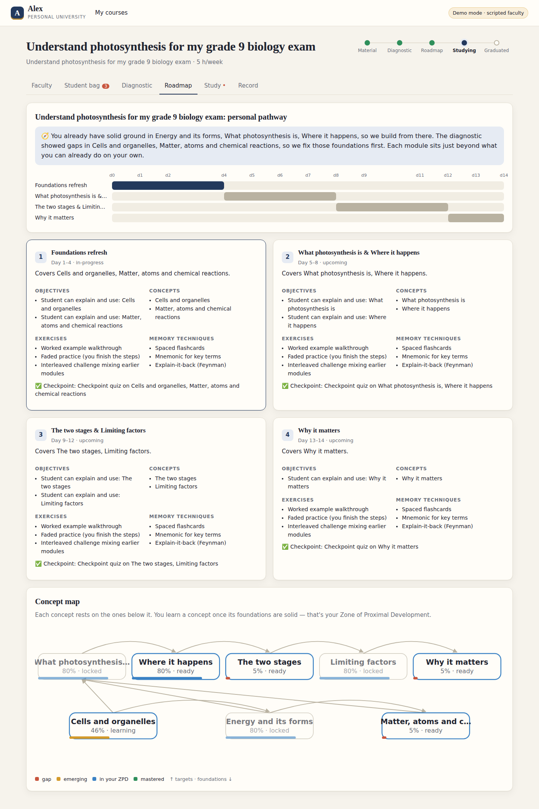
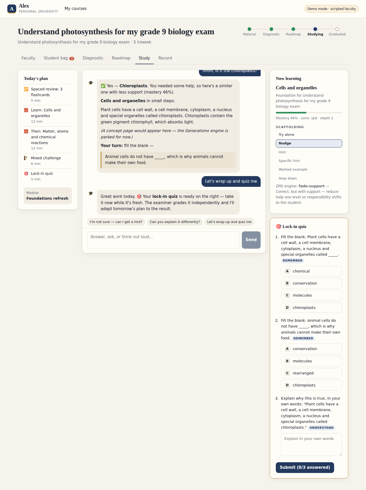

# Project Alex: a personal university for self-learners

Alex is an AI learning system that teaches anything, the way a great one-to-one tutor would. It finds where your knowledge ends and teaches from that point, one step beyond what you can do alone: your **Zone of Proximal Development**. It uses well-supported learning techniques along the way: contingent scaffolding, retrieval practice, spaced repetition, mastery learning, and memorization aids such as memory palaces and mnemonics.

It is built on the open-source **[Pi agent](https://github.com/badlogic/pi-mono)** (`@mariozechner/pi-agent-core`) as its agent harness.

## The faculty

| Role | Responsibility |
|---|---|
| 📚 **Librarian** | Collects material from the curated resource vault, the web, and whatever you upload. Ingests and indexes it into your **student bag**, and extracts points to remember with memory aids and flashcards. |
| 🧭 **Advisor** | Plays the syllabus committee. Maps the concepts, including the foundations underneath them, and after the diagnostic designs a personalized roadmap and timeline that fits your deadline and hours per week. |
| 🎓 **Tutor** | Teaches you live. Proposes today's plan, activates what you already know, teaches one concept at a time, and adjusts hints to how you're doing: nudge → hint → worked example → **step down** to missing basics. Keeps your diary and ends each session with a quiz. |
| ⚖️ **Editorial** | An independent examiner. Writes the diagnostics and quizzes and grades them without bias: objective items are graded in code, open answers against a rubric. Keeps your exam record. |
| 🎬 **Generations** | *Parked.* Will pre-generate images, animations, concept pages, mind maps, memory palaces and slide decks. The interface and UI slots are already in place. |

## The journey

1. **Goal**: type what you want to learn and/or drop in your PDFs and notes. A deadline is optional.
2. **Material**: the Librarian fills your bag, and the Advisor maps the concepts.
3. **Diagnostic**: Editorial tests the targets *and* their foundations.
4. **Roadmap**: the Advisor connects what you already know to the goal, and the weakest foundations come first.
5. **Daily sessions**: review what's due, then learn the next concept on your frontier, then practice with scaffolding, then take on a challenge.
6. **Lock in**: every session ends with a quiz, the results update your mastery, and modules advance until you finish the course.

## Screens

| | |
|---|---|
|  |  |
| **Intake**: goal, material, deadline | **Study room**: plan · tutor · ZPD scaffolding ladder |
|  |  |
| **Roadmap**: rationale, timeline, modules, concept map | **Lock-in quiz** from the Editorial examiner |

## Run it

```bash
npm install
npm run dev            # server on :8787 + web on :5173 → open http://localhost:5173
```

With no API key, Alex runs in **demo mode**. A scripted "demo brain" stands in for the language model, but the whole harness runs for real: agent loop, tool calls, ZPD engine, grading and storage. This lets you click through the complete journey offline. For the real faculty:

```bash
export ANTHROPIC_API_KEY=sk-ant-...
export ALEX_MODEL=claude-sonnet-5          # default; per role: ALEX_MODEL_TUTOR, ALEX_MODEL_ADVISOR, ...
export TAVILY_API_KEY=...                  # optional web search (or BRAVE_API_KEY); falls back to Wikipedia
npm run dev
```

For production, run `npm run build && npm start`. The server then also serves the built UI on `:8787`.

Other scripts:

* `npm test` runs the learning-engine unit tests and an end-to-end journey test (demo mode).
* `npm run typecheck` typechecks the server and the web app.

## Documentation

* [docs/ARCHITECTURE.md](docs/ARCHITECTURE.md): the harness, roles, workflow, data layout and API.
* [docs/PEDAGOGY.md](docs/PEDAGOGY.md): the teaching method, the research behind it, and where each piece lives in the code.
